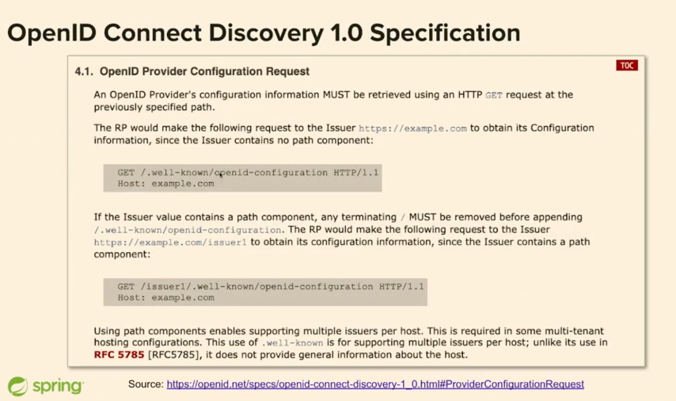
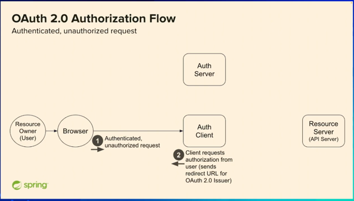
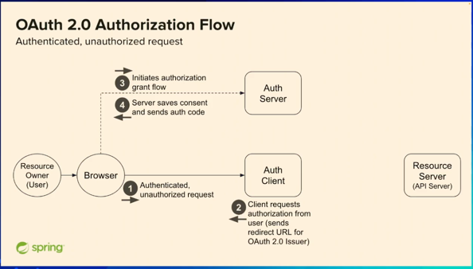
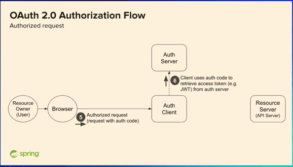
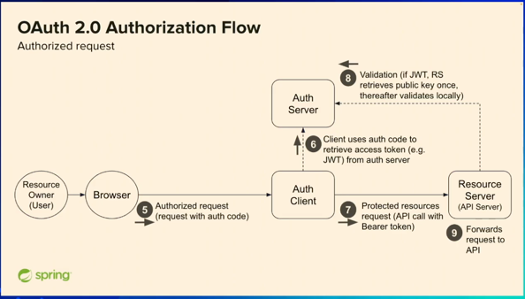
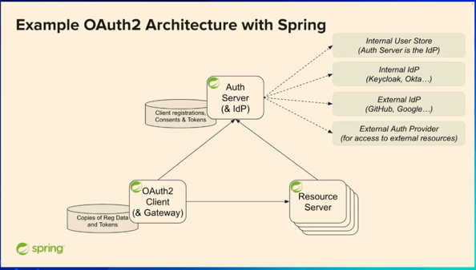
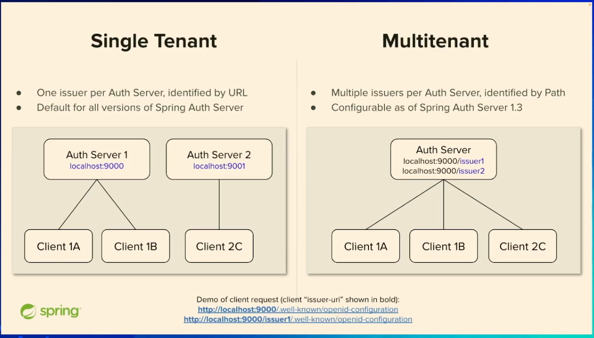
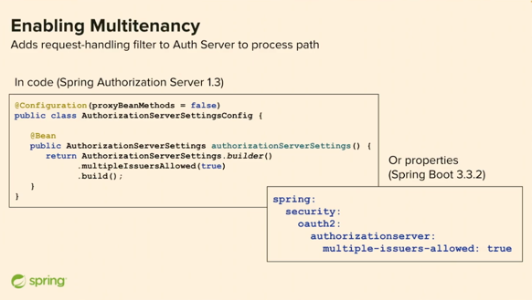
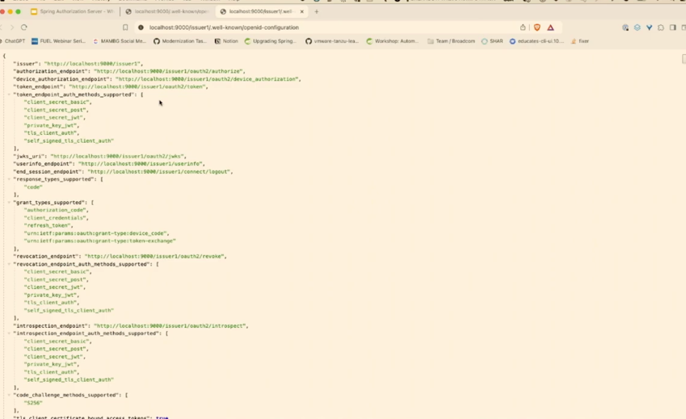
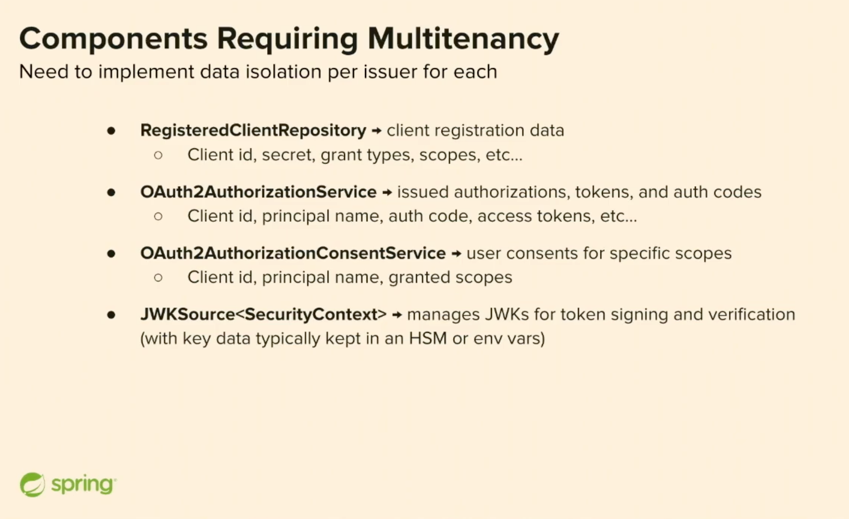

### Get started
  - docker run --name postgres -e POSTGRES_PASSWORD=mangalsathi_password -e POSTGRES_DB=mangalsathi_db -e POSTGRES_USER=mangalsathi_user -p 5432:5432 -d postgres:18.1-alpine3.22
  - docker exec -it postgres psql -U mangalsathi_user -d mangalsathi_db
  - show tables : \dt
### OpenID spec

### Flow
  - When you are authenticated but don't have right authority.  
    
  - Redirect back to browser and negotiate to authorzation server and return auth code.  
      
  - Exchange auth code for access token and refresh token.  
    
  - Access protected resource with access token.  
    

### Architecture
- Spring Security OAuth2 Resource Server
- Spring Security OAuth2 Client
- Spring Security OAuth2 Authorization Server

### Single Tenant vs Multi Tenant

### Code
- Allow multiple issuer in SecurityConfig.java
  

  - AuthorizationConfiguration.java
   